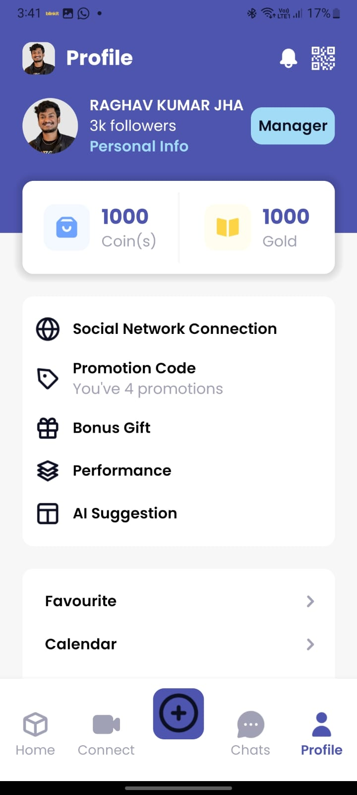
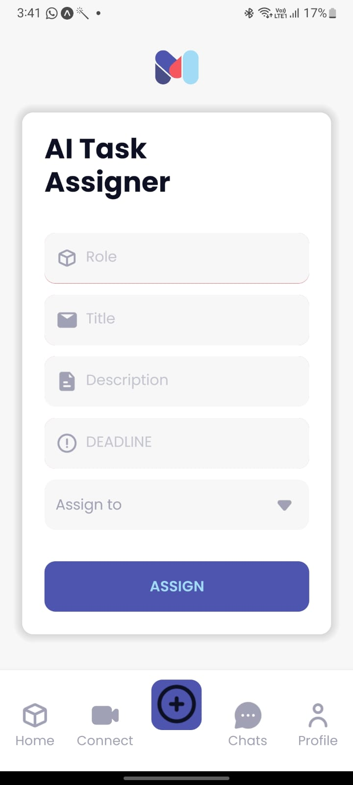
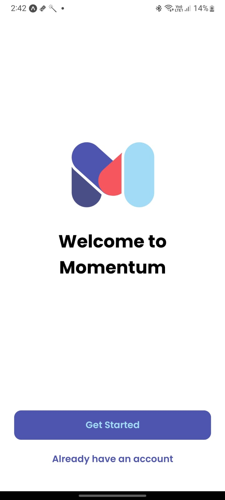
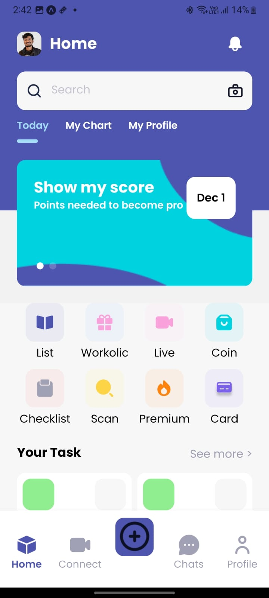

<h1 align="center">:octocat: Momentum App :octocat:</h1>

## Table of Contents

- [Table of Contents](#table-of-contents)
- [Introduction](#introduction)
- [Features](#features)
- [Requirements](#requirements)
- [How To Run](#how-to-run)
- [Screenshoot](#screenshoot)
- [Future Scope](#FutureScope)
- [Contributors](#contributors)

## Introduction
In the fast-paced landscape of remote work, teams encounter persistent challenges in managing tasks, fostering effective communication, and sustaining motivation. As a response to these hurdles, our team at NIT Karnataka's 48-hour hackathon presents Momentum. This application serves as a dynamic solution, engineered to tackle the shortcomings of traditional project management tools, ensuring adaptability to the evolving needs of remote teams.
 

## Features
* Task Dashboard
* Real-time Collaboration
* AI-Driven Task Allocation
* Performance Analytics
* Collaboration Feature
* Cross-Platform Compatibility
* Proactive Reminders
* Gamification
* Real time notification
* Calendar
* OCR Feature
* Predictive Task Prioritization

## Requirements
* [`npm`](https://www.npmjs.com/get-npm)
* [`react native`](https://facebook.github.io/react-native)
* [`flask`](https://flask.palletsprojects.com/en/3.0.x/)
* [`redux`](https://redux.js.org/)
* [`react navigation`](https://reactnavigation.org/)
  

   
## How To Run Front End

1. Clone this repository
   ```
   $ https://github.com/Binbasri-in/girl-geek-hackathon-nitk.git
   ```
2. Install all depedencies on the package.json
   ```
   $ cd girl-geek-hackathon-nitk
   $ npm i
   ```
3. Run Application
   ```
   $ npx expo start 
   $ Scan the Qr in expo app or Enter 'a' to run on emulator 
   ```


   ## How To Run Back End

1. Install all requirements.txt
   ```
   $ cd backend
   $ cd girl-geek-hackathon-nitk
   $ pip install -r requirements.txt
   ```
3. Run Backend
   ```
   $ python app.py
   ```

OR
Deploy it to Heroku and <a href="https://github.com/Binbasri-in/try_hack_deploy">here is the guide</a>


## Screenshoot
<div align="center">
      
     
        
    
      

</div>


## FutureScope
* Multilingual Support
* Dark and Light Mode
* More Ai Assistence
* Firewalls
* Doc Support
* Doc Editing
* Integrated Meeting

## Contributors
<center>
  <table>
    <tr>
      <td align="center">
        <a href="https://github.com/raghav029">
          <br/>
          <sub><b>RAGHAV KUMAR JHA</b></sub>
        </a>
      </td>
<!--       -->
       <td align="center">
        <a href="https://github.com/krishna1804g">
          <br/>
          <sub><b>Krishna</b></sub>
        </a>
      </td>
      <td align="center">
        <a href="https://github.com/">
          <br/>
          <sub><b>Mimansa</b></sub>
        </a>
      </td>
      <td align="center">
        <a href="[https://github.com/Sammy-100](https://github.com/Binbasri-in)">
          <br/>
          <sub><b>Mohammed Ali </b></sub>
        </a>
      </td>
    </tr>
  </table>
</center>
